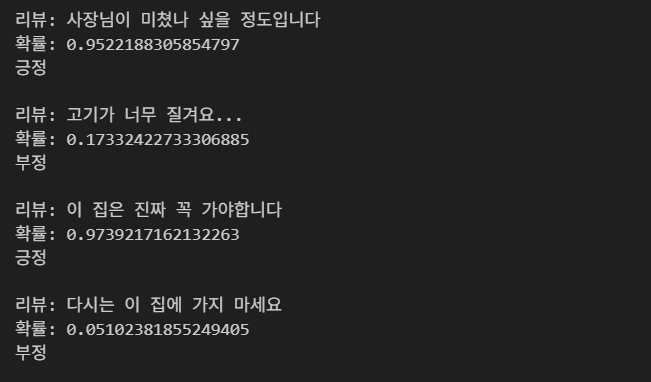

# 훈이의 식당 리뷰 감성 분석에 오신 강사님을 환영합니다💕

**직접 실행하기 위해서는 아래 코드에 해당하는 학습 데이터 전처리 부분을 건너뛰어 주세요. 시간이 너무 오래 걸려 따로 `preprocessed_sentences`를 저장해놓았습니다 (이를 불러오는 코드가 포함되어 있습니다).**

```python
from konlpy.tag import Okt
from nltk import word_tokenize, sent_tokenize
from tqdm import tqdm

okt = Okt()

preprocessed_sentences = []

for review in tqdm(reviews):
    review = re.sub(r"[^가-힣0-9\s]", "", review)   # 구두점, 특수문자, 영문 제거
    review = re.sub(r"\s+", " ", review).strip()   # 여러 공백을 하나의 공백으로
    tokens = okt.morphs(review, stem=True, norm=True) # 토큰화
    tokens = filter_tokens(tokens)
    preprocessed_sentences.append(tokens)
```

## 결과




### 17기 화이팅! 강사님 감사합니다!
